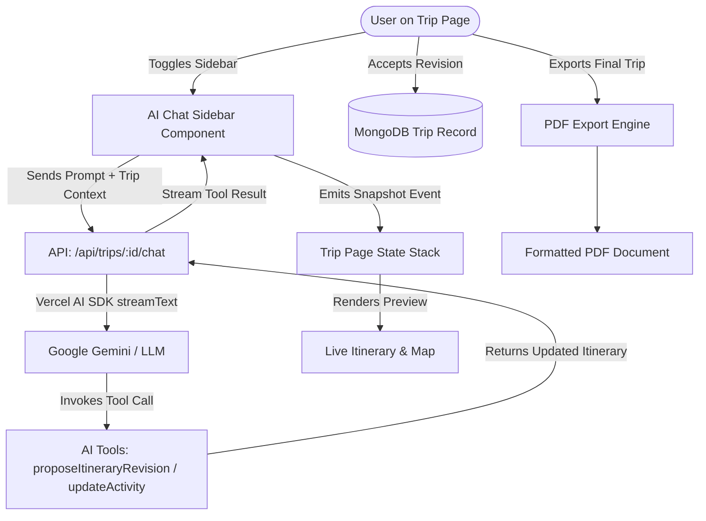

# 🗺️ Roadmap & Implementation Guide: AI Chat Sidebar, Trip Versioning & PDF Export

This guide provides a comprehensive, step-by-step architectural blueprint to build the **AI Assistant Chat Sidebar**, **Live Itinerary Snapshots**, and **PDF Export** features for your travel agent application.

It is structured so you can code and practice building each module yourself, complete with technical hints, state management patterns, API designs, and edge-case checklists.

---

## 📐 System Architecture Overview

---

## 🛠️ Step-by-Step Implementation Roadmap

### Phase 1: Snapshot & Version State Management
**Goal:** Allow the user to preview AI-generated itinerary modifications without immediately overwriting their saved trip in the database.

#### 💡 Core Design Hints:
1. **Define a Snapshot Data Type**: Create a TypeScript interface for snapshots (e.g. `ItinerarySnapshot` containing `id`, `timestamp`, `description`, `itinerary`, and `status: 'draft' | 'applied'`).
2. **State Stack in `app/trips/[id]/page.tsx`**:
   - `savedItinerary`: The canonical itinerary loaded from MongoDB.
   - `activeItinerary`: The currently displayed itinerary (defaults to `savedItinerary`).
   - `snapshots`: An array of proposed AI revisions created during the current chat session.
   - `selectedSnapshotId`: Tracks whether the user is previewing a draft snapshot or viewing the saved plan.
3. **Action Handlers**:
   - `handleApplySnapshot(snapshot)`: Sends a `PATCH` request to `/api/trips/[id]` to save the snapshot as the canonical itinerary.
   - `handleDiscardSnapshot()`: Reverts `activeItinerary` back to `savedItinerary`.

---

### Phase 2: AI Tool Calling & Chat API Route
**Goal:** Build a robust API endpoint where the AI receives the existing trip context and can invoke structured tools to edit activities or propose complete revisions.

#### 📍 Suggested Location: `app/api/trips/[id]/chat/route.ts`

#### 💡 Core Design Hints:
1. **System Prompt Construction**: Include destination, start/end dates, traveler count, budget, preferences, and the current `itinerary` JSON in the system prompt.
2. **Tool Definition with Vercel AI SDK (`ai` package)**:
   - Use `streamText` with `google(...)` and define `tools` using `zod` schemas.
   - **Tool 1: `proposeItineraryRevision`**
     - Accepts a complete or partial `itinerary` object (using your existing `itinerarySchema` from `@/lib/schemas/itenerary`).
     - Description hint: *"Proposes an updated multi-day itinerary when the user requests overall changes (e.g., 'Make day 2 more budget friendly', 'Add a beach afternoon')."*
   - **Tool 2: `updateSpecificActivity`**
     - Accepts `dayNumber`, `activityTitle`, and modified properties (`timeSlot`, `locationName`, `locationLatitude`, `locationLongitude`, `category`, `estimatedCost`).
     - Description hint: *"Updates or replaces a single specific activity within the trip."*
3. **Stream Handling**: Return a `createUIMessageStreamResponse` or standard stream response using `toUIMessageStream`.

---

### Phase 3: Toggleable AI Chat Sidebar UI
**Goal:** Create a responsive, accessible slide-over chat interface with live tool invocation feedback.

#### 📍 Suggested Component: `components/trip-chat-sidebar.tsx`

#### 💡 Core Design Hints:
1. **Vercel AI SDK `useChat` Integration**:
   - Utilize `useChat({ api: \`/api/trips/\${tripId}/chat\` })`.
   - Pass custom `body` parameters containing current trip state if needed.
2. **Handling Tool Call Outputs on the Client**:
   - Loop over `message.parts` or inspect tool invocations in `useChat`.
   - When a tool call completes (e.g., `proposeItineraryRevision`), automatically trigger a callback prop `onProposeSnapshot(newItinerary, summaryDescription)`.
3. **UI Polish & Accessibility**:
   - Use Lucide icons (`BotIcon`, `SparklesIcon`, `SendIcon`, `ChevronRightIcon`).
   - Render quick prompt chips at the top of the chat (e.g., *"Reduce budget by 20%"*, *"Swap dinner for seafood"*, *"Add kid-friendly activities"*).
4. **Draft Snapshot Banner**:
   - When a draft snapshot is active, render a top bar above the itinerary:
     > ⚡ **Previewing AI Revision:** "Substituted Day 2 dinner with local street food tour"
     > `[Apply Changes]` `[Discard]`

---

### Phase 4: High-Quality PDF Export Component
**Goal:** Allow users to export their finalized trip plan into a beautifully structured, printable PDF.

#### 💡 Technology Recommendation:
You have two great choices for Next.js / React 19:
- **Option A (Recommended for vector precision):** `@react-pdf/renderer`
  - Allows writing clean declarative React components for PDF generation.
- **Option B (Recommended for fast implementation):** Browser print stylesheet (`@media print`) or `html2pdf.js` / `jspdf` + `html2canvas`.

#### 📍 Suggested Location: `components/trip-pdf-document.tsx` & `components/export-pdf-button.tsx`

#### 💡 Core Layout Hints for the PDF:
1. **Cover & Trip Details Header**:
   - Large bold title, trip destination badge, dates, party size, total estimated budget.
2. **AI Advisories / Exception Cases (If Any)**:
   - Colored box for budget notes or site closure warnings.
3. **Day-by-Day Itinerary Schedule**:
   - Grid or table layout with Time Slot, Category, Title, Location, and Cost breakdown.
4. **Summary & Notes**:
   - Total calculated cost vs target budget.

---

## 📋 Comprehensive Checklist & Edge Cases

- [ ] **Coordinate Integrity**: Ensure AI tool calls generate valid `locationLatitude` and `locationLongitude` numbers so Leaflet maps don't crash when rendering snapshots.
- [ ] **Unsaved Draft Warning**: Prompt the user if they attempt to navigate away while viewing an unapplied snapshot.
- [ ] **Cost Recalculation**: Automatically recalculate `estimatedTotalCost` whenever activities are modified by the AI tool call.
- [ ] **Stream Error Handling**: Gracefully display toast notifications if the AI stream fails or rate limits occur.
- [ ] **PDF Dynamic Content**: Ensure all days and activities wrap cleanly across page boundaries without clipping text.

---

## 🚀 Recommended Implementation Order

1. **Step 1:** Create `app/api/trips/[id]/chat/route.ts` with Vercel AI SDK `streamText` & tool definition.
2. **Step 2:** Build `components/trip-chat-sidebar.tsx` and integrate it into `app/trips/[id]/page.tsx`.
3. **Step 3:** Implement snapshot state logic (`activeItinerary`, preview bar, apply/discard actions).
4. **Step 4:** Test chat modifications and verify live updates on the timeline & Leaflet map.
5. **Step 5:** Build the PDF Export component and button.

*Happy Coding! You have all the tools and architecture needed to craft an extraordinary AI-powered travel planning experience.*
